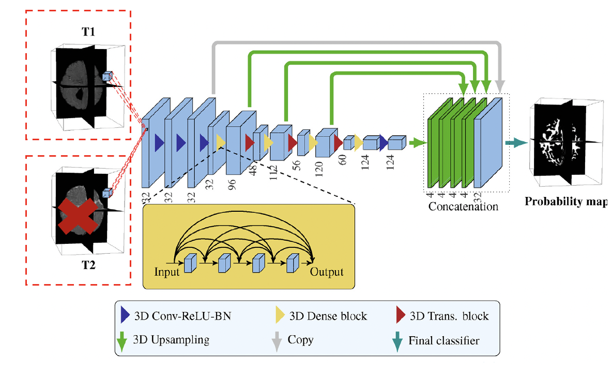
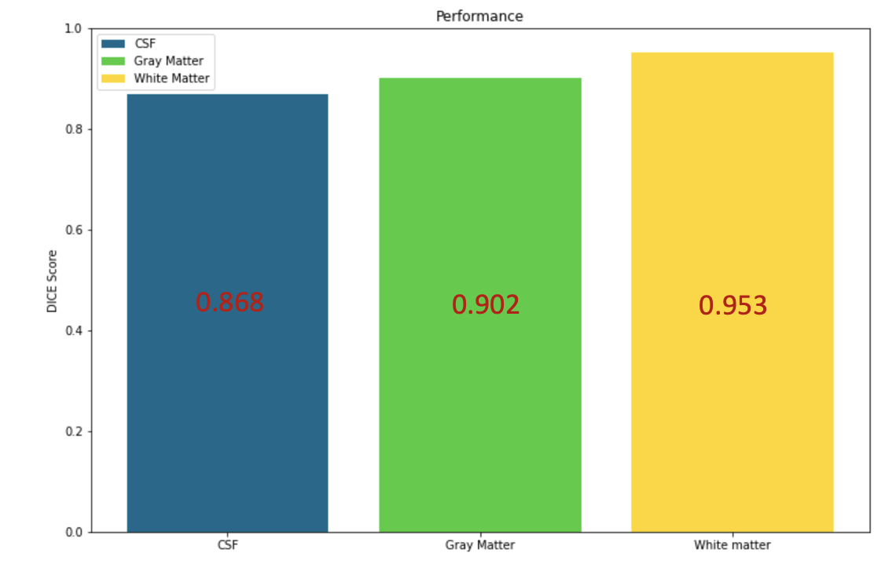
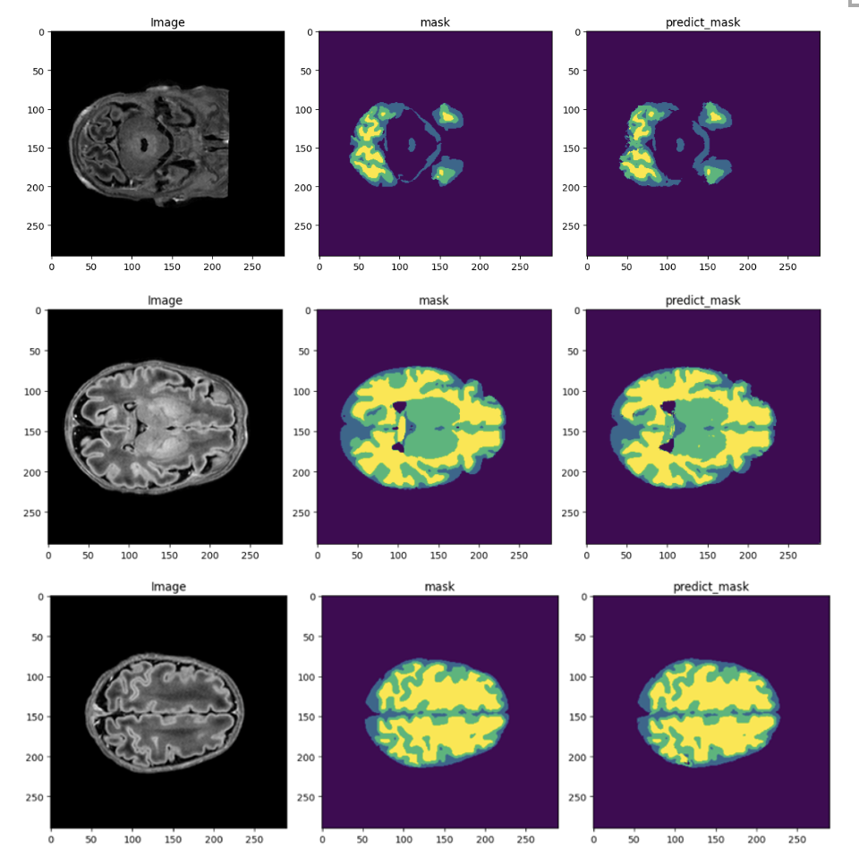

# Deep-Learning-for-Infant-Brain-MRI-Tissue-Volumetric-Segmentation
Deep learning models have been explored for the automation of infant MRI image segmentation into white matter (WM), gray matter (GM) and cerebrospinal fluid (CSF), which faces challenges including the lack of contrast between WM and GM especially around the cortical regions and the limited data availability. Here, I proposed the use of a 3D densely connected convolutional network (DenseNet) with skip connections for the infant brain MRI volumetric segmentation task. The model was first trained with a larger adult brain MRI dataset and then with the small infant dataset using transfer learning, as adult brain MRI has better image contrast and larger dataset size compared with the infant brain MRI dataset.

## Dataset
In this project, two datasets are used to train the proposed model. The first dataset is called dHCP based on the source “Developing Human Connectome Project”, which contains a relatively small set of MRI images obtained from multiple infant subjects. The dataset chosen is based on 6 subjects, 3 male and 3 female, with ages varying between 39 and 42 weeks during the scan time. The second dataset, termed ‘IBSR’, was provided by Massachusetts General Hospital and it contains brain MRI obtained images of human adults which was released in 2013.

## Model Architecture
The proposed model is mainly based on the 3D DenseNet architecture proposed in the iseg-2017 challenge (T. D. Bui, J. Shin, and T. Moon, "Skip-connected 3D DenseNet for volumetric infant brain MRI segmentation," Biomedical Signal Processing and Control, vol. 54, 2019, doi: 10.1016/j.bspc.2019.101613), which consists of down-sampling path and the up-sampling path. We further used transfer learning between adult brain MRI dataset and infant brain MRI dataset for performance improvement.

## Codes
All the necessary codes for data loading, data preprocessing, model construction and evaluation are included in ./DenseNet_VolumetricSeg.ipynb

## Performance
**Quantitative performance:**  
With transfer learning, the model achieved an average dice score of 0.908, with the individual score for WM, GM, CSF shown below.

**Qualitative performance:**  
The segmentation images of the volumetric data is shown below. The predicted mask agrees well with the ground truth (mask).

